# ✈️ Travel Management System

# 📖 Project Overview

The **Travel Management System** is a desktop-based Java application that simplifies travel booking and management. It provides an interactive graphical interface for managing customers, travel packages, hotel bookings, payments, invoices, and tourist destinations.

This project is developed using **Java Swing**, **AWT**, **JDBC**, **MySQL**, and **iText PDF** while following Object-Oriented Programming principles.

---

# ✨ Key Features

### 👤 Customer Management
- Add Customer
- View Customer Details
- Update Customer Information
- Delete Customer

### 🎒 Package Management
- View Travel Packages
- Book Packages
- View Booked Packages

### 🏨 Hotel Management
- View Hotels
- Search Hotels
- Book Hotels
- View Booked Hotels

### 💳 Payment Module
- Booking Payment
- Payment Confirmation

### 📄 Invoice Generation
- Generate Professional PDF Invoice
- Booking Summary
- Customer Details
- Payment Details

### 🌍 Destinations
- Full Screen Destination Slider
- Interactive Destination Explorer
- Beautiful Tourist Places

### ℹ️ About Section
- Application Information
- Developer Details

---

# 🛠 Technologies Used

| Technology | Description |
|------------|-------------|
| Java | Programming Language |
| Swing | GUI Development |
| AWT | UI Components |
| JDBC | Database Connectivity |
| MySQL | Database |
| iText PDF | Invoice Generation |
| VS Code | IDE |
| Git | Version Control |
| GitHub | Project Hosting |

---

# 📂 Project Structure

```
Travel-Management-System
│
├── src
│   ├── travel
│   │      └── management
│   │              └── system1
│   │
│   └── icons
│
├── Screenshots
│
├── lib
│   ├── mysql-connector-j.jar
│   └── itextpdf-5.5.13.jar
│
├── build
│
└── README.md
```

---

# 📷 Screenshots

## 🔐 Login Page

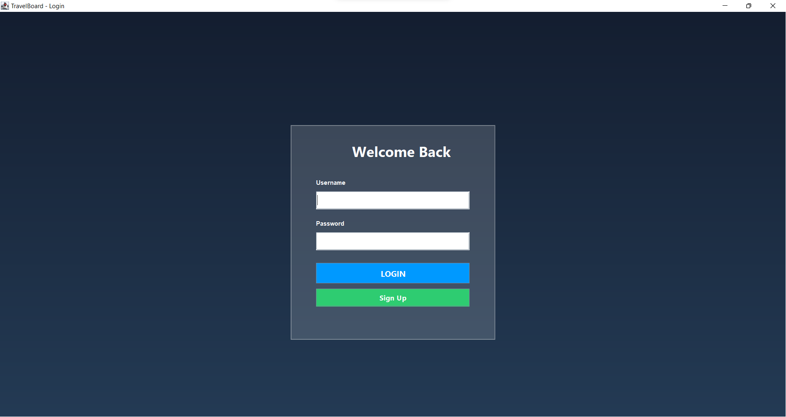

---

## 🏠 Dashboard

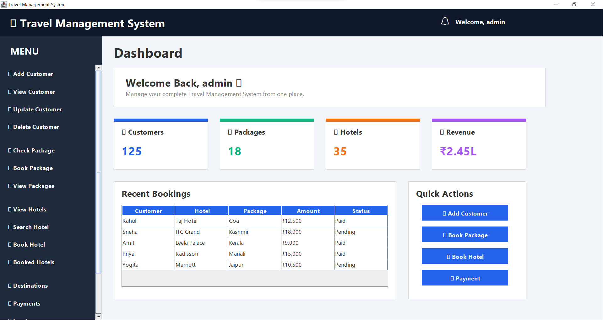

---

## 👤 Customer Profile

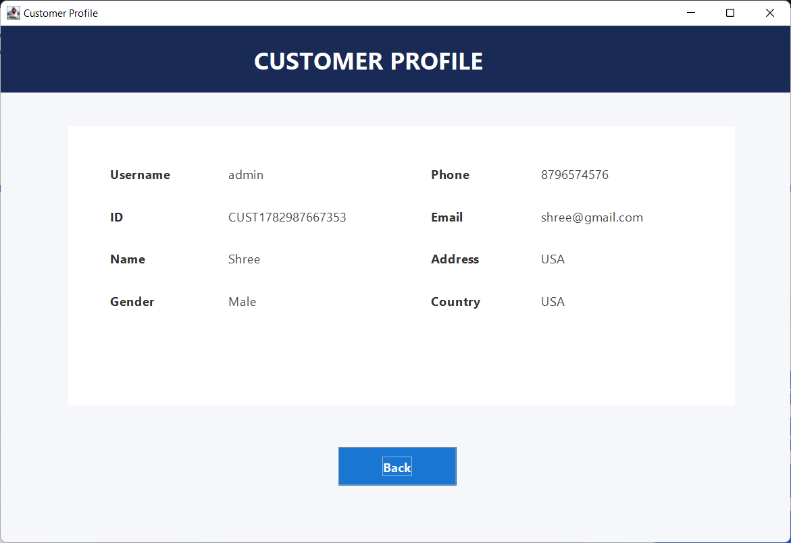

---

## ✏️ Update Customer

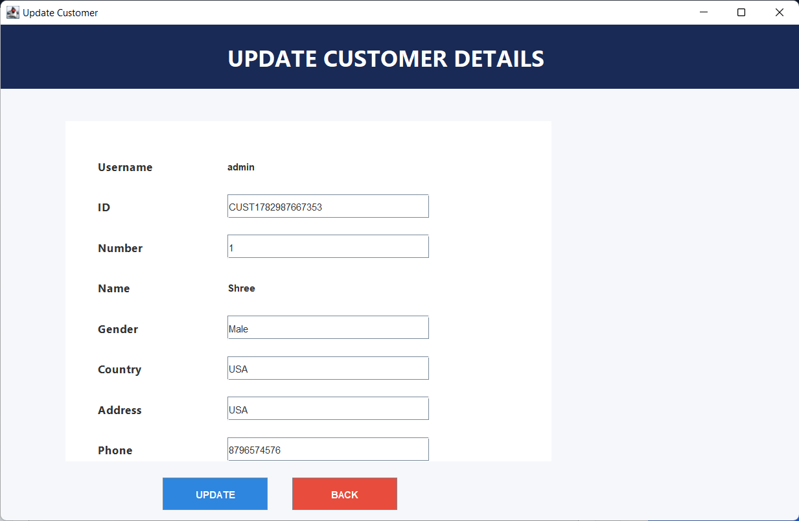

---

## ❌ Delete Customer

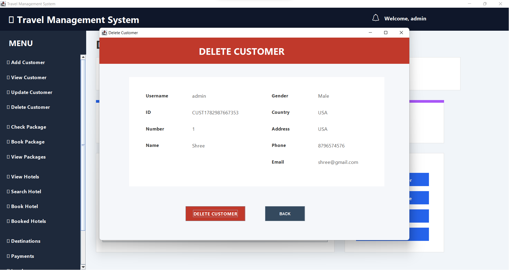

---

## 🎒 Book Package

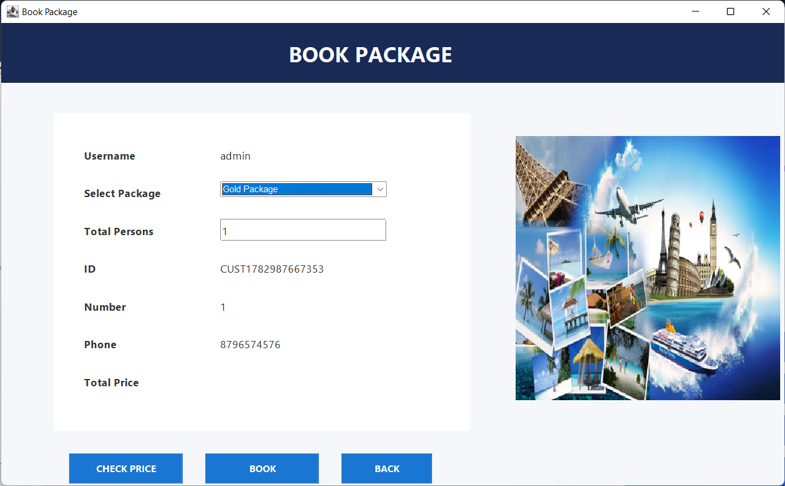

---

## 📦 Booked Package

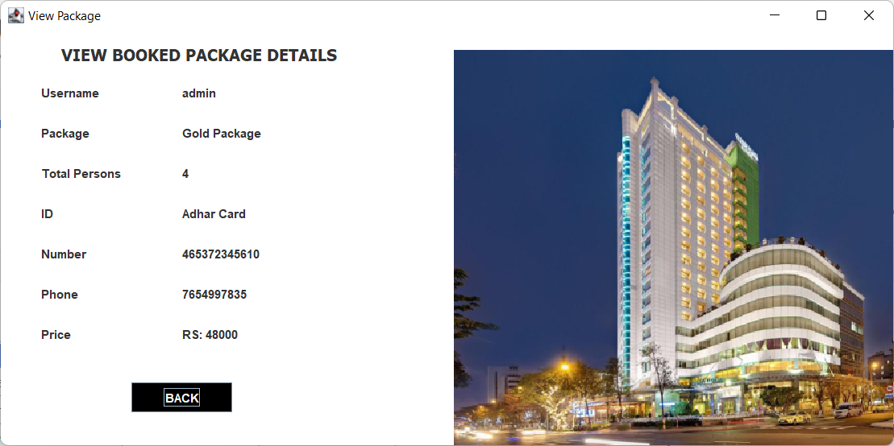

---

## 📋 View Package

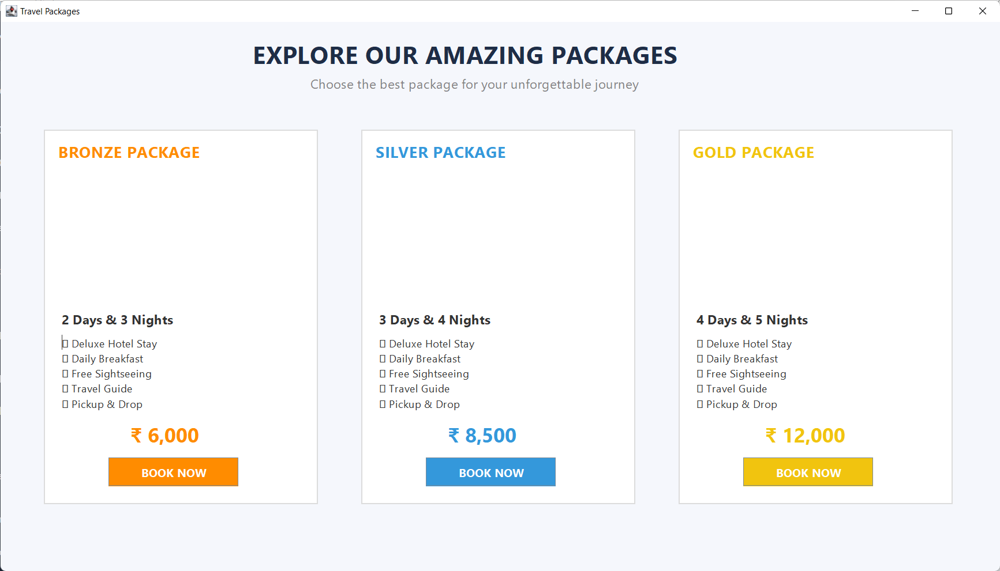

---

## 🏨 View Hotels

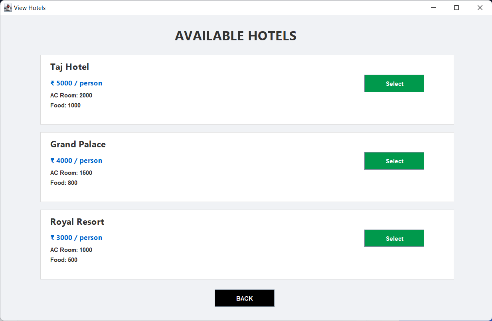

---

## 🔍 Search Hotel

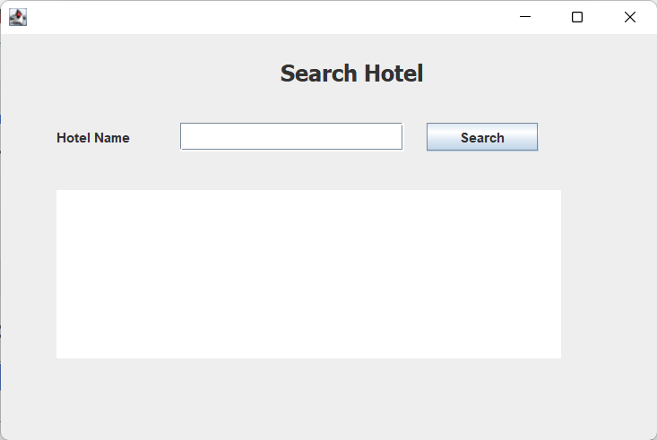

---

## 🛏 Book Hotel

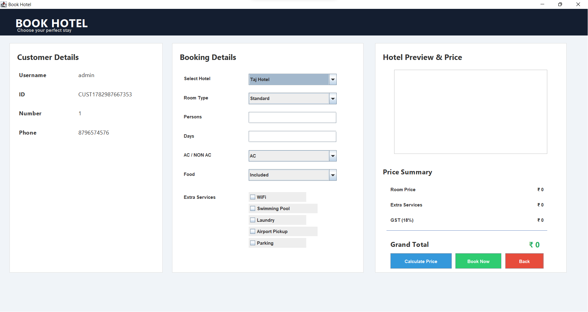

---

## 📖 View Booked Hotel

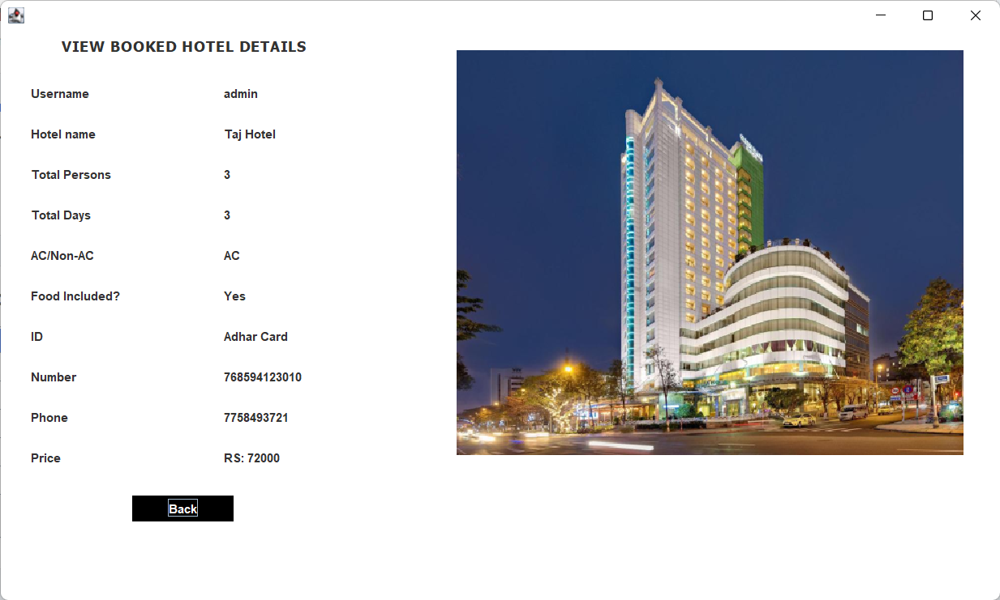

---

## 🌍 Destinations

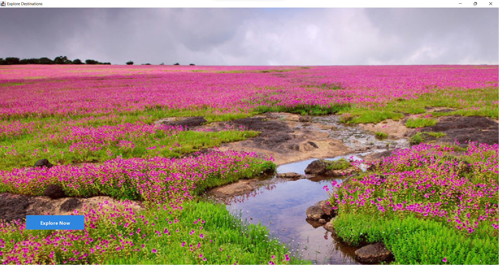

---

## 💳 Payment

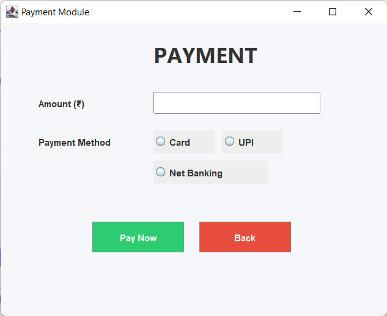

---

# ⚙️ Installation Guide

### Clone Repository

```bash
git clone https://github.com/yogitapawar3676-pixel/Travel-Management-System.git
```

### Open Project

Open the project in **VS Code**.

### Configure Database

- Install MySQL
- Create the required database
- Import your SQL tables
- Update database credentials in `Conn.java`

### Add Required Libraries

- MySQL Connector
- iTextPDF 5.5.13

### Compile

```bash
javac -cp "lib/*" -d build/classes src/travel/management/system1/*.java
```

### Run

```bash
java -cp "build/classes;lib/*" travel.management.system1.login
```

---

# 🚀 Future Enhancements

- Role-based authentication (Admin/User)
- Online payment gateway integration
- Email & SMS booking confirmations
- Hotel ratings and reviews
- Booking history and reports
- Search packages by budget and destination
- Dashboard analytics
- Export reports to Excel
- Cloud database support
- Responsive modern UI

---

# 📚 Learning Outcomes

This project helped me gain practical experience in:

- Core Java Programming
- Object-Oriented Programming (OOP)
- Java Swing & AWT GUI Development
- Event Handling
- JDBC Database Connectivity
- MySQL CRUD Operations
- SQL Query Writing
- Exception Handling
- PDF Generation using iText
- Project Structure & Code Organization
- Git & GitHub Version Control

---

# 👩‍💻 Developer

**Yogita Pawar**

📧 Email: *(yogitapawar3676@gmail.com)*

🔗 GitHub: https://github.com/yogitapawar3676-pixel

---

